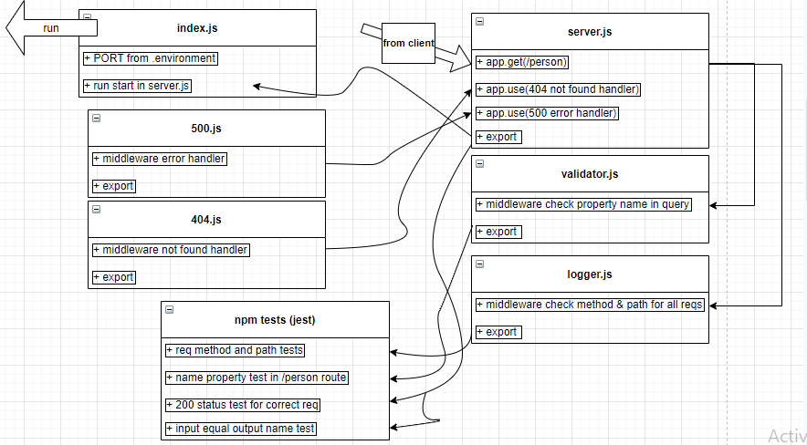

# basic-express-server

**Author: Ahmad Abu Osbeh**
<br>

- tests report
- back-end

**Setup**
<br>

- .env requirements
- PORT - 3003
- Running the app
- npm start
- Endpoint: /person?name=${name}
- Returns : json with requested name

```
{
"domain": "https://ahmadosbeh-basic-express-serve.herokuapp.com/",
"status": "running",
"port": 3003
}
```

<example hit : https://ahmadosbeh-basic-express-serve.herokuapp.com/person?name=ahmad>

**Tests**

**using supertest and jest**

- Unit Tests: npm run test

# UML

<br>


